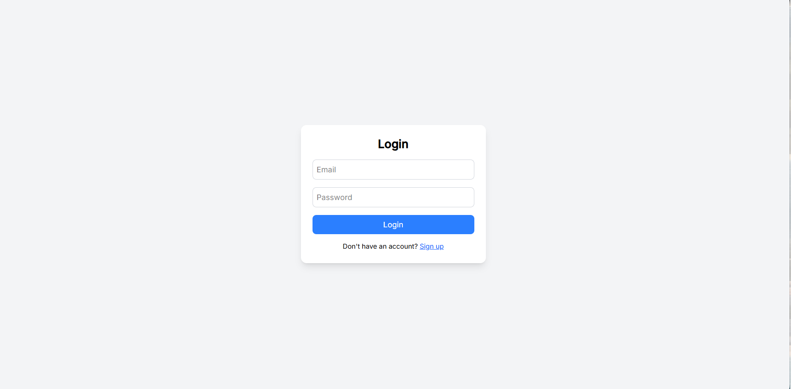
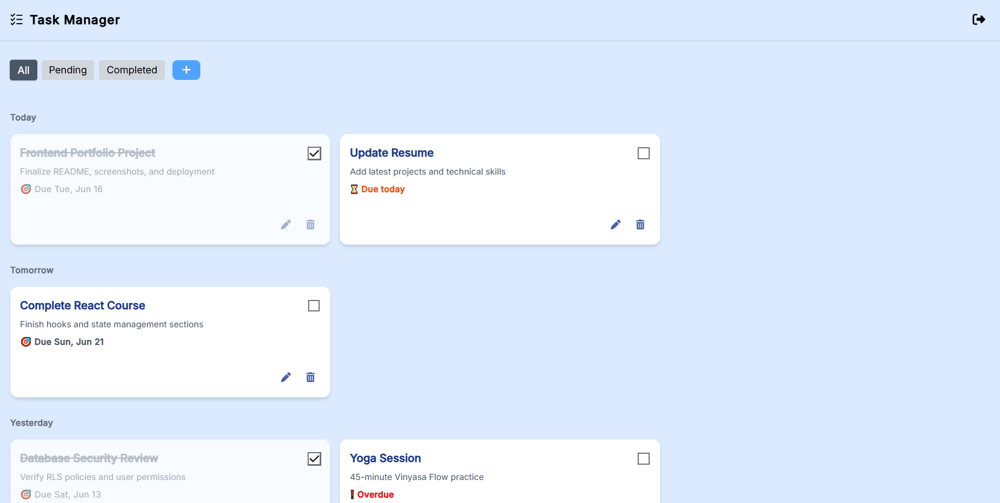
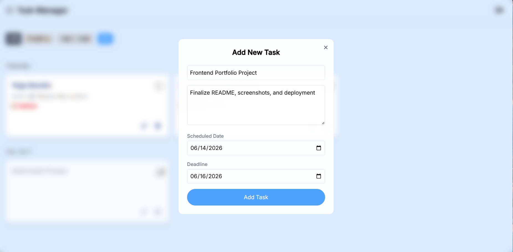
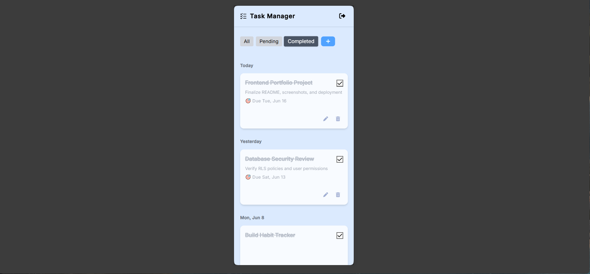

# 📌 Task Management App

A full-featured task management web application built with Vue 3 and Supabase.

The app allows users to manage their tasks through a clean and responsive interface with authentication, task scheduling, automatic date-based grouping, deadline tracking, task filtering, and full CRUD functionality.


---

## ✨ Features

- 🔐 Authentication with Supabase (Login / Sign Up)
- 📋 Create, update, delete, and complete tasks
- 📅 Schedule tasks with custom dates
- 🗂️ Smart task organization with Today, Tomorrow, Yesterday, and dynamic date-based grouping
- ⏰ Deadline management with due date display
- 🚨 Overdue and Due Today indicators
- 🔍 Filter tasks by status (All / Pending / Completed)
- ⏳ Loading skeletons and empty states
- 📱 Responsive user interface
- 🌐 Supabase backend integration

---

## ⭐ Project Highlights

- Built with Vue 3 Composition API
- Smart date-based task organization
- Supabase Authentication and Database integration
- Clean component-based architecture
- Deployed on Vercel
  
---

## 🧩 Project Structure

```bash
src/
├── components/
│   ├── auth/
│   ├── dashboard/
│   │   ├── layout/
│   │   ├── tasks/
│   │   └── Dashboard.vue
│   └── ui/
├── router/
├── utils/
├── App.vue
├── main.js
├── style.css
└── supabase.js
```

---

## 🛠️ Tech Stack

- Vue 3
- Vue Router
- Tailwind CSS
- Supabase
- JavaScript (ES6+)
- Vite

---

## 🚀 Run Project Locally

### Install dependencies

```bash
npm install
```

### Start development server

```bash
npm run dev
```

### Build for production

```bash
npm run build
```

---

## 🌍 Live Demo

👉 **[View Live Application](https://task-manager-snowy-tau-77.vercel.app)**

---

## 📸 Screenshots

### 🔐 Authentication


### 📋 Task Dashboard


### ➕ Task Creation


### 📱 Mobile Experience


---

## 🎯 What I Learned

- Designing and building a full CRUD application
- Integrating Vue 3 with Supabase Authentication and Database
- Organizing components using a scalable folder structure
- Managing UI states such as loading, empty, and error states
- Creating responsive layouts with Tailwind CSS
- Deploying production-ready applications with Vercel