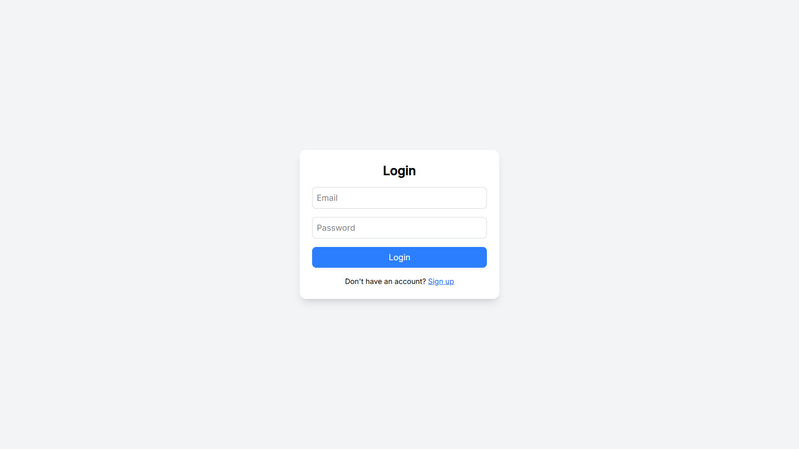
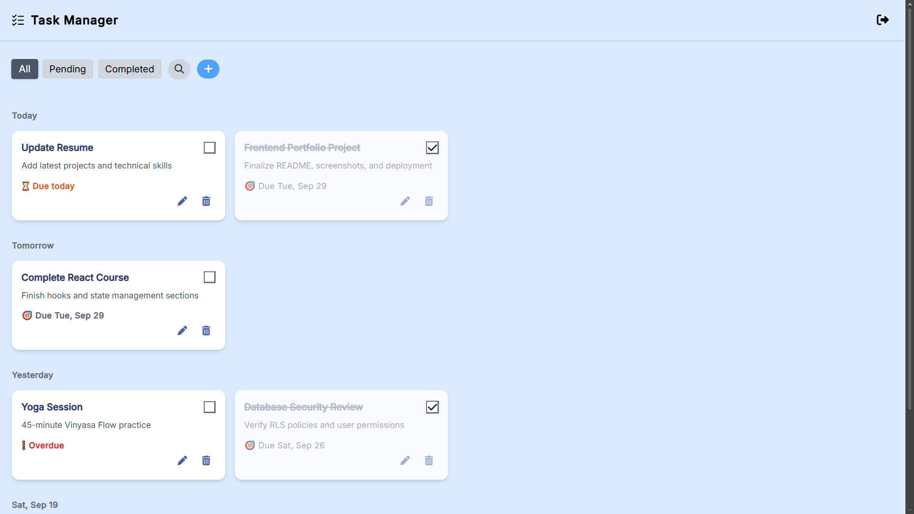
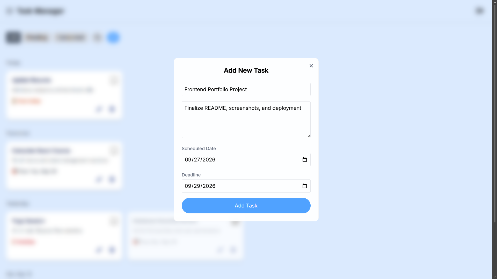
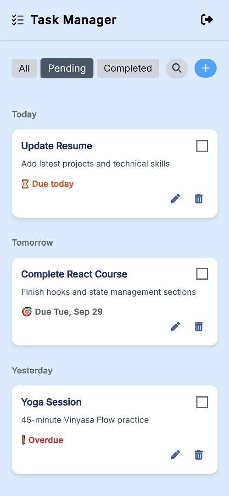

# 📌 Task Management App

A task management web application built with Vue 3 and Supabase.

The app allows users to create and manage tasks through a clean and responsive interface with authentication, task scheduling, date-based grouping, deadline tracking, filtering, search, and full CRUD functionality.


---

## ✨ Features

- 🔐 Authentication with Supabase (Login / Sign Up)
- 📋 Create, edit, delete, and complete tasks
- 📅 Schedule tasks with custom dates
- 🗂️ Automatic task grouping by date
- ⏰ Deadline tracking with due dates, Due Today, and Overdue indicators
- 🔍 Search tasks by title or description
- 🔽 Filter tasks by status (All / Pending / Completed)
- ⏳ Loading skeletons and empty states
- 🚨 Error handling with retry support
- 🌐 Offline status indicator
- 📱 Responsive user interface
- 🔒 Row Level Security (RLS) for user-specific data

---

## 🛠️ Tech Stack

- Vue 3
- Vue Router
- JavaScript
- Tailwind CSS
- Supabase
- Vite
- Vitest
- Vue Test Utils

---

## ⭐ Project Highlights

- Vue 3 Composition API
- Component-based architecture
- Reusable error handling composable
- Date and deadline handling
- Supabase Authentication and Database integration
- User-specific data protection with RLS
- Unit and component testing with Vitest and Vue Test Utils
- Responsive UI with Tailwind CSS
- Deployed on Vercel

---

## 🧩 Project Structure

```text
src/
├── components/
│   ├── dashboard/
│   │   ├── layout/
│   │   └── tasks/
│   └── ui/
├── composables/
├── router/
├── tests/
├── utils/
├── views/
│   ├── auth/
│   ├── Dashboard.vue
│   └── NotFound.vue
├── App.vue
├── main.js
├── style.css
└── supabase.js

supabase/
├── schema.sql
└── policies.sql
```

---

## 🚀 Run Project Locally

### Install dependencies

```bash
npm install
```

### Configure environment variables

Create a `.env` file in the project root:

```env
VITE_SUPABASE_URL=your_supabase_url
VITE_SUPABASE_ANON_KEY=your_supabase_anon_key
```

### Start development server

```bash
npm run dev
```

### Run tests

```bash
npm run test
```

### Build for production

```bash
npm run build
```

---

## 🌍 Live Demo

👉 **[View Live Application](https://task-manager-snowy-tau-77.vercel.app)**

---

## 📸 Screenshots

### 🔐 Authentication


### 📋 Task Dashboard


### ➕ Task Creation


### 📱 Mobile Experience


---

## 🎯 What I Learned

- Building a CRUD application with Vue 3
- Integrating Vue 3 with Supabase Authentication and Database
- Structuring a Vue application with reusable components and composables
- Managing loading, empty, error, and offline UI states
- Implementing search, filtering, task scheduling, and deadline handling
- Creating responsive layouts with Tailwind CSS
- Writing unit and component tests with Vitest and Vue Test Utils
- Deploying a web application with Vercel